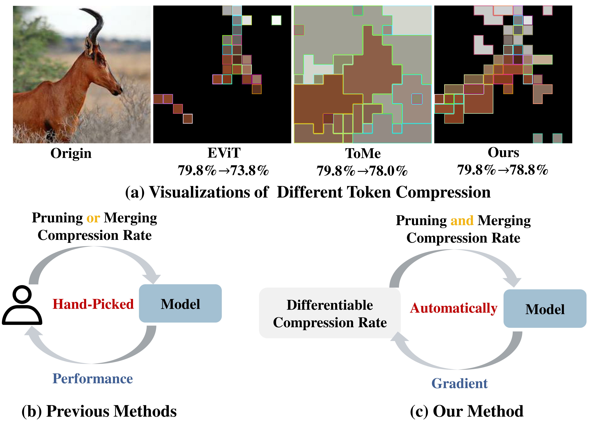

# DiffRate (ICCV 2023)
This a official Pytorch implementation of our paper "[DiffRate : Differentiable Compression Rate for Efficient Vision Transformers](https://arxiv.org/abs/2305.17997)"


## What DiffRate Does

Previous methods typically focus on either pruning or merging tokens using hand-picked compression rate with the guidance of performance. But DiffRate can leverages both approaches simultaneously to achieve more effective compression using the differentiable compression rate with gradient optimization.

## Requirements
```
- python >= 3.8
- pytorch >= 1.12.1  # For scatter_reduce
- torchvision        # With matching version for your pytorch install
- timm == 0.4.5      # Might work on other versions, but this is what we tested
- jupyter            # For example notebooks
- scipy              # For visualization and sometimes torchvision requires it
- termcolor          # For logging with color
```


## Data Preparation
- The ImageNet dataset should be prepared as follows:
```
ImageNet
├── train
│   ├── folder 1 (class 1)
│   ├── folder 2 (class 2)
│   ├── ...
├── val
│   ├── folder 1 (class 1)
│   ├── folder 2 (class 2)
│   ├── ...

```

## Pre-Trained Models
Our proposed DiffRate is designed to operate utilizing the officially endorsed pre-trained models of MAE and DeiT. To facilitate seamless integration, our code is programmed to automatically download and load these pre-trained models. However, users who prefer manual downloads can acquire the pre-trained MAE models via this [link](https://github.com/facebookresearch/mae/blob/main/FINETUNE.md), and the pre-trained DeiT models through this [link](https://github.com/facebookresearch/deit/blob/main/README_deit.md).
 


## Evaluation
We provide the discovered compression rates in the [compression_rate.json](https://github.com/anonymous998899/DiffRate/blob/main/compression_rate.json) file. To evaluate these rates, utilize the `--load_compression_rate` option, which will load the appropriate compression rate from [compression_rate.json](https://github.com/anonymous998899/DiffRate/blob/main/compression_rate.json) based on the specified `model` and `target_flops`.

<details>

<summary>DeiT-S</summary>

For the `ViT-S (DeiT)` model, we currently offer support for the `--target_flops` option with `{2.3,2.5,2.7,2.9,3.1}`. To illustrate, an example evaluating the `ViT-S (DeiT)` model with `2.9G` FLOPs would be:
```
python main.py --eval --load_compression_rate --data-path $path_to_imagenet$ --model vit_deit_small_patch16_224 --target_flops 2.9
```
This should give:
```
Acc@1 79.538 Acc@5 94.828 loss 0.902 flops 2.905
```

</details>

<details>

<summary>DeiT-B</summary>

For the `ViT-B (DeiT)` model, we currently offer support for the `--target_flops` option with `{8.7,10.0,10.4,11.5,12.5}`. To illustrate, an example evaluating the `ViT-B (DeiT)` model with `11.5G` FLOPs would be:
```
python main.py --eval --load_compression_rate --data-path $path_to_imagenet$ --model vit_deit_base_patch16_224 --target_flops 11.5
```
This should give:
```
Acc@1 81.498 Acc@5 95.404 loss 0.861 flops 11.517
```
</details>

<details>

<summary>ViT-B (MAE)</summary>

For the `ViT-B (MAE)` model, we currently offer support for the `--target_flops` option with `{8.7,10.0,10.4,11.5}`. To illustrate, an example evaluating the `ViT-B (MAE)` model with `11.5G` FLOPs would be:
```
python main.py --eval --load_compression_rate --data-path $path_to_imagenet$ --model vit_base_patch16_mae --target_flops 11.5
```
This should give:
```
Acc@1 82.864 Acc@5 96.148 loss 0.794 flops 11.517
```
</details>

<details>

<summary>ViT-L (MAE)</summary>

For the `ViT-L (MAE)` model, we currently offer support for the `--target_flops` option with `{31.0,34.7,38.5,42.3,46.1}`. To illustrate, an example evaluating the `ViT-L (MAE)` model with `42.3G` FLOPs would be:
```
python main.py --eval --load_compression_rate --data-path $path_to_imagenet$ --model vit_large_patch16_mae --target_flops 42.3
```
This should give:
```
Acc@1 85.658 Acc@5 97.442 loss 0.683 flops 42.290
```
</details>

<details>
<summary>ViT-H (MAE)</summary>

For the `ViT-H (MAE)` model, we currently offer support for the `--target_flops` option with `{83.7,93.2,103.4,124.5}`. To illustrate, an example evaluating the `ViT-H (MAE)` model with `103.4G` FLOPs would be:
```
python main.py --eval --load_compression_rate --data-path $path_to_imagenet$ --model vit_huge_patch14_mae --target_flops 103.4
```
This should give:
```
Acc@1 86.664 Acc@5 97.894 loss 0.602 flops 103.337
```
</details>

<details>
<summary>CAFormer-S36</summary>

For the `CAFormer-S36` model, we currently offer support for the `--target_flops` option with `{5.2,5.6,6.0}`. To illustrate, an example evaluating the `CAFormer-S36` model with `5.6` FLOPs would be:
```
python main.py --eval --load_compression_rate --data-path $path_to_imagenet$ --model caformer_s36 --target_flops 5.6
```
This should give:
```
Acc@1 83.910 Acc@5 96.710 loss 0.712 flops 5.604
```
</details>


## Training

To find the optimal compression rate by proposed `DiffRate`, run the following code:
```
python -m torch.distributed.launch \
--nproc_per_node=4 --use_env  \
--master_port 29513 main.py \
--arch-lr 0.01 --arch-min-lr 0.001 \
--epoch 3 --batch-size 256 \
--data-path $path_to_imagenet$ \
--output_dir $path_to_save_log$ \
--model $model_name$ \
--target_flops $target_flops$
```
- supported `$model_name$`: `{vit_deit_tiny_patch16_224,vit_deit_small_patch16_224,vit_deit_base_patch16_224,vit_base_patch16_mae,vit_large_patch16_mae,vit_huge_patch14_mae,caformer_s36}`
- supported `$target_flops$`: a floating point number

For example, search a `2.9G` compression rate schedule for `ViT-S (DeiT)`:
```
python -m torch.distributed.launch \
--nproc_per_node=4 --use_env  \
--master_port 29513 main.py \
--arch-lr 0.01 --arch-min-lr 0.001 \
--epoch 3 --batch-size 256 \
--data-path $path_to_imagenet$ \
--output_dir $path_to_save_log$ \
--model vit_deit_small_patch16_224 \
--target_flops 2.9
```

## Visualization
See [visualization.ipynb](https://github.com/anonymous998899/DiffRate/blob/main/visualization.ipynb) for more details.

## Citation
If you use DiffRate or this repository in your work, please cite:
```
@article{DiffRate,
  title={DiffRate : Differentiable Compression Rate for Efficient Vision Transformers},
  author={Mengzhao Chen, Wenqi Shao, Peng Xu, Mingbao Lin, Kaipeng Zhang, Fei Chao, Rongrong Ji, Yu Qiao, Ping Luo},
  journal={arXiv preprint arXiv:2305.17997},
  year={2023}
}
```

## Acknowledge
This codebase borrow some code from [DeiT](https://github.com/facebookresearch/deit) and [ToMe](https://github.com/facebookresearch/ToMe). Thanks for their wonderful work.
